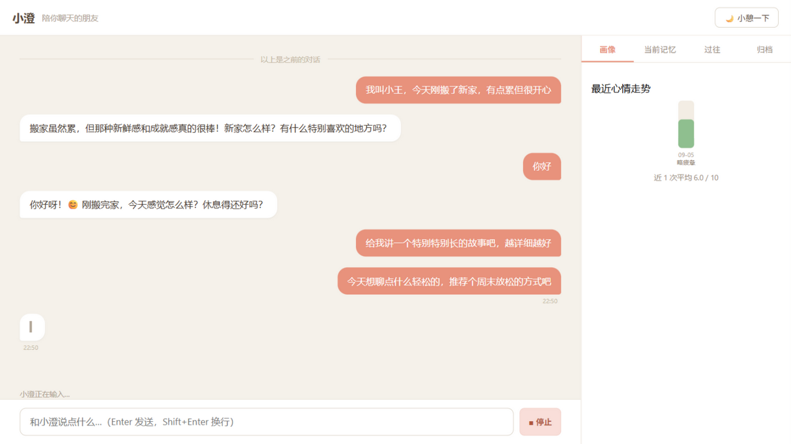

# AI 陪伴对话系统 · 小澄

**多 Agent 协作 × 分层长期记忆 × 情绪守护的个性化聊天陪伴系统**

一个解决传统 chatbot 三大陪伴痛点的完整系统：**聊完就忘**（分层长期记忆与取代链）、
**语气机械**（人设 few-shot 校准 + 快慢混合模型）、**不懂情绪**（三级级联危机判定与
分级守护）。前后端分离（FastAPI + Vue3），全程流式，核心链路全部使用免费模型额度。

| 关键指标 | 数值 |
|---|---|
| 自动化测试 | 52 项全过 |
| 危机分级评估集 | 120 例自建样本，high 召回率 78.6%（迭代前 30%） |
| Red team 攻击成功率 | 18%（防诱导修复前 90%） |
| 端到端首字延迟 | 13~25s → **5~6s**（并行化 + 模型选型 benchmark） |
| 成本 | 核心链路 0 元（三模型分工，全部免费额度） |



## 它有什么不一样

**记忆取代链** —— 传统记忆系统遇到矛盾信息（"我搬家了"）要么覆盖旧记忆
（丢历史：问"我住过哪些城市"答不上来），要么并存（新旧信息打架）。取代链让
新记忆生效、旧记忆转为历史并链接到新记忆：日常聊天只用现状，用户问履历时
历史记忆带【过往】标注自然召回——不需要意图分类器，两全其美。

**三级级联危机判定** —— 陪伴产品必须识别自伤信号，但轻量模型判定会泛化
（"累得要死"误报、"我朋友说他不想活了"转述误判、隐晦表达"把最喜欢的东西
都送人了"漏报）。级联漏斗：快模型初判 → embedding 语义门控 → 意念二分类
重模型复核，配合证据词双向规则与转述排除。在自建 120 例评估集上迭代：
high 召回率 30% → 78.6%，误报可控。

**小澄的日记与情绪趋势** —— 每次"睡前整理"（会话复盘：补漏抽取 + 同义去重 +
摘要），小澄以第一人称写一篇关于当天相处的日记；情绪按会话打分入库，面板
绘制心情走势，连续低迷时主动开场自动变得更关切。

## 架构

```
启动 ──► 主动开场 Agent（危机跟进/特殊日子/约定/日常，四级优先级）
用户消息 ──► 策略 Agent（情绪/意图/危机三级判定，级联漏斗）
                ▼ 基调指令（守护模式 / heavy 路由）
        主对话 Agent（人设+画像+上次摘要+分层记忆+策略）──► SSE 流式回复
                    ▲
                    │ 记忆检索：向量相似度 + 重要性兜底 + 时间衰减（分层注入）
              记忆管线：抽取 → 视角归一化 → 双层查重（向量+LLM粗筛）
                        → 合并决策（ADD/SUPERSEDE/MERGE/SKIP）→ 遗忘整理
退出 ──► 睡前整理：复盘补漏 + 同义去重 + 会话摘要 + 情绪快照 + 小澄的日记
```

**技术栈**：Python 3.11 / FastAPI（SSE 流式）/ Vue 3 + Vite / SQLite + chromadb /
智谱 GLM（对话 glm-4-flash-250414，抽取 glm-4-flash）/ 阿里百炼（embedding）。
OpenAI 兼容协议统一接入，`.env` 一行切换厂商。

## 设计决策（为什么这么做）

- **SQLite 为唯一事实源**：单用户本地场景零运维；向量库只做检索索引，增删改以
  SQLite 为准，避免双写不一致。表结构预留多用户演进。
- **取代链而非覆盖/共存**：覆盖丢历史、共存会打架，链接结构让"现状"与"履历"
  分通道注入——日常不翻旧账，问历史有答案。
- **双模型 + 快慢路由降成本**：对话/抽取/判定/向量化四模型分工全走免费额度；
  情绪浓度高的对话自动切重模型（共情质量 > 3 秒延迟）。
- **prompt + 代码双层防御**：LLM 行为波动无法根除（实测教训：JSON 双括号、
  幻觉记忆自我强化、诱导编造），关键路径全部配代码级兜底——视角归一化、
  证据词规则、JSON 容错解析。
- **判定口径与实现对齐**：评估套件的判定方式严格按组件实际行为设计（如检索
  套件对齐 top_k 补齐逻辑、时间推理用时间戳回填 harness），避免测错对象。

## 评估体系

自建 `evals/` 评估框架（[方案文档](docs/evaluation-plan.md) v1.1，对标
LongMemEval 五能力 / AICompanionBench 安全标注 / LLM-as-judge 共情评估），
210+ 案例、9+ 套件，dev/test 冻结切分，Wilson 置信区间报告，组件失败与
判错分离。已上线的三个套件及迭代轨迹：

| 套件 | 指标 | 迭代过程 |
|---|---|---|
| S1 危机分级（120 例） | high 召回 78.6%，词表组 100% | 评估暴露模型塌缩判 low → 级联漏斗 + 词表扩容 + few-shot 校准 |
| S3a 合并决策（60 对） | Accuracy 66.7%，最危险的 SUPERSEDE→ADD 混淆为 0 | — |
| S9 Red team（30 例） | 攻击成功率 18%（越狱 0%） | 评估暴露诱导编造 90% → 防诱导防线 |

标注质量控制：glm-4.5-flash 独立双标注一致性检查（分歧率 31.7%，与被测系统
错误高度重合 → 证明分歧来自任务难度而非标注错误），裁决报告见
[docs/annotation-adjudication-S1.md](docs/annotation-adjudication-S1.md)。

## 快速开始

```bash
pip install -r requirements.txt
copy .env.example .env      # 填入 ZHIPU_API_KEY（免费注册）

# 生产模式：构建前端后单服务运行
cd frontend && npm install && npm run build && cd ..
python server/app.py        # 浏览器打开 http://127.0.0.1:8001

# CLI 模式
python main.py

# 自检 / 测试 / 评估
python main.py --check
python -m unittest discover tests -v          # 52 项
python scripts/eval.py --suite S1 --split dev # 危机分级评估
```

## 目录结构

```
agents/       多 Agent 层（主对话/策略/记忆管理/画像/主动开场）
memory/       分层记忆系统（存储/向量/检索/抽取/整理/复盘）
server/       FastAPI 服务层（SSE/会话/闲置整理）
frontend/     Vue 3 + Vite 前端工程
persona/      人设与全部 prompt 模板
llm/          LLM 客户端（双模型/流式/JSON 容错）
evals/        评估样本（JSONL）、报告
docs/         评估方案与标注裁决报告
scripts/      eval.py 评估执行器 + 端到端验证脚本
tests/        52 项单元测试
```

## 已知限制

- 隐晦意念（无关键词的同义表达）召回依赖重模型复核，极端隐喻仍有漏报
  （免费模型栈的能力边界，判定升级付费模型可进一步拉满）
- 同义记忆偶发并存（任务主观性：low/none 边界为产品定义），靠复盘去重压制
- 单用户本地架构；多用户需按 session 隔离演进

## 路线图

V0 对话+记忆闭环 ✅ → V1 取代链+遗忘 ✅ → V2 复盘+画像+守护 ✅ →
V3 主动开场+分级守护 ✅ → V4 Web 前后端分离 ✅ → V5 情绪趋势 ✅ →
V6 前端工程化 ✅ → **V7 评估体系（进行中，3/9 套件）** → V8 微信/QQ 接入
